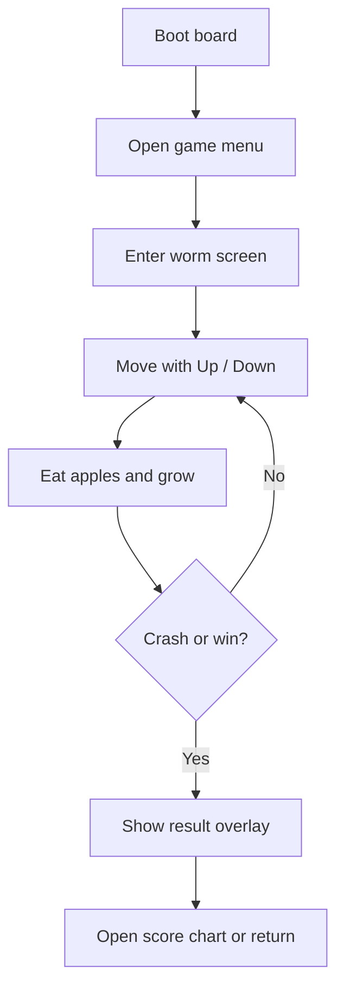
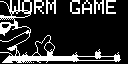
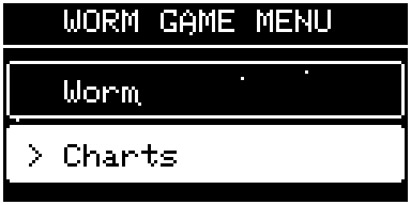
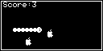
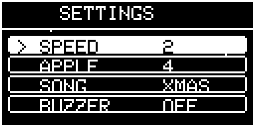

# AK Worm Game for AK Embedded Base Kit

[](https://github.com/the-ak-foundation)

This repository contains the firmware for the worm game that runs on the AK Embedded Base Kit with STM32L151. The project is a hands-on example of event-driven embedded programming: the screen, buttons, buzzer, timers, EEPROM, and task scheduler work together to present a complete game loop rather than a single demo screen.

The board is designed for embedded learning and prototyping. It combines a 1.54" OLED display, 3 push buttons, a buzzer, RS485, Qwiic, and Grove connectivity so you can study interaction, timing, persistence, and modular firmware architecture on real hardware.

[](https://epcb.vn/products/ak-embedded-base-kit-lap-trinh-nhung-vi-dieu-khien-mcu)

## Quick Start

If you just want to understand the game quickly, this is the shortest path:

1. Build the firmware with `make -C application`.
2. Flash the application to the board at `0x08003000`.
3. Use Mode to enter or confirm.
4. Use Up and Down to move through menus and settings.
5. Enter the worm screen, move the worm, eat apples, and avoid collisions to itself.



## Contents

Use this table to jump to major sections in this README.

- [Quick Start](#quick-start)
- [Contents](#contents)
- [How To Read This Project](#how-to-read-this-project)
- [What This Game Is About](#what-this-game-is-about)
- [Main Features](#main-features)
- [Hardware Context](#hardware-context)
- [Memory Map](#memory-map)
- [Game Flow](#game-flow)
- [Game design](#game-design)
- [Internal Game IDs and Tasks](#internal-game-ids-and-tasks)
- [Settings](#settings)
- [Controls](#controls)
- [Build](#build)
- [Development (Build & Flash)](#development-build--flash)
- [Contributing](#contributing)
- [License](#license)
- [Support & Resources](#support--resources)

## How To Read This Project

- If you are playing the game, read the game overview, controls, and quick start sections first.
- If you are changing firmware behavior, focus on internal game IDs, task ownership, and settings persistence.
- If you are building or flashing, jump straight to the build and flashing sections.

## What This Game Is About

Worm is a compact arcade game built for the display and controls on the Ak Kit. The player moves a worm around the screen, eats apples, avoids crashing into itself, and tries to survive long enough to grow as much as possible. The game also includes a score system, visual feedback, and buzzer music.

The important part of this project is not only the gameplay itself, but how the gameplay is split into small tasks:

- One task owns the worm movement.
- One task owns apples.
- One task owns score handling.
- One task handles collision and eating logic.
- One task manages borders.
- One task coordinates the main game screen.
- One task manages lives. (Optional)

That structure makes the firmware easier to reason about and is a good reference if you are studying cooperative embedded state machines.

## Main Features

- OLED-based worm gameplay with a clean animated screen.
- 3-button control scheme for menu navigation and gameplay.
- Persistent game settings stored in EEPROM.
- Adjustable worm speed from slow to fast.
- Adjustable apple count.
- Selectable buzzer music loop.
- Buzzer enable or disable option.
- Score tracking and top score flow.
- Event-driven task architecture with timer-based updates.

## Hardware Context

The firmware targets the AK Embedded Base Kit hardware stack:

- STM32L151 MCU.
- 1.54" OLED display (V3) or 1.3" OLED display (V2)
- 3 push buttons.
- Buzzer for sound effects and looping music.
- Additional interfaces on the board such as RS485, Qwiic, and Grove, which are part of the larger platform even when not used directly by the worm game.

### Memory Map

- `0x08000000` - Boot firmware.
- `0x08002000` - Boot/Application shared data region.
- `0x08003000` - Application firmware.

The application is linked to start at `0x08003000` so it matches the boot layout and the shared flash map used by the Ak Kit.

## Game Flow

The game is organized as a screen-driven application:

1. The firmware boots and initializes hardware, tasks, timers, and optional modules.
2. The display shows the main app flow and menu screens.
3. The player enters the worm game screen.
4. The worm is reset, apples are initialized, score is cleared, and music starts if enabled.
5. The game runs on periodic ticks driven by the scheduler.
6. If the player crashes or wins, the game shows an overlay.
7. The player can move to the score chart screen or back out to the menu.

The worm screen itself is also responsible for starting and stopping the background music loop, so the audio state always matches the visible game state.

## Game design

The game UI is structured into a few clear screens that guide the player from power-on to gameplay, settings, and score review. Each screen is designed to be compact and readable on the small OLED while providing the player with clear feedback and control.

### Startup Screen




The startup screen shows the board and firmware identity, provides a brief boot animation and offers entry into the main app menu. It confirms hardware is initialized (display, buttons, buzzer) and gives a short visual cue if saved settings or scores were loaded successfully.

### Menu Screen



The menu screen is the central hub. Menu entries are arranged vertically and can be navigated with Up/Down; Mode enters or confirms. Visual highlights and simple icons make it easy to pick modes (Start Game, Settings, Charts). Menu animations are subtle to keep the UI responsive.

### Worm Game (Playfield)



This is the core gameplay screen. The player controls the worm with Up/Down to change direction. Apples appear as targets; eating them grows the worm and increases score. The HUD is intentionally minimal: score, lives (if enabled), and a small status indicator for buzzer/music.

### Game Over / Result


When the player crashes the worm, an overlay appears with the final score and options to retry or return to the menu. A short buzzer melody and a crisp visual overlay emphasize the result while preserving the final playfield for reference.

### Settings Screen



Settings let the player tune gameplay and audio quickly:

- Worm speed: five discrete steps from slow to fast.
- Apple count: change the number of active apples (1–8).
- Music selection: choose from a set of looped tunes.
- Buzzer: toggle sound on or off.

Controls are mapped consistently so a short hold action loads presets while single presses adjust the selected value.

---

Design notes

- Visual clarity: the renderer uses bold pixels and a clear glyph set so text and icons remain legible on the small OLED.
- Modularity: each gameplay system (worm, apples, score, collisions) is owned by a separate task, making it easy to change pacing or rules without touching rendering code.
- Accessibility: simple 3-button controls and presets let new players start quickly without digging through menus.

## Internal Game IDs and Tasks

The phrase “game ID” in this codebase is best understood as the internal task ID used by the scheduler. These are not player-facing IDs; they are numeric identifiers that let the firmware route messages to the correct task.

The IDs are declared in [application/sources/app/task_list.h](application/sources/app/task_list.h). The main game-related entries are:

- `GAME_APPLE_ID` - apple spawning and apple lifecycle.
- `GAME_WORM_ID` - worm movement and direction control.
- `GAME_SCORE_ID` - score calculation and persistence.
- `GAME_EATING_ID` - eating detection and related interactions.
- `GAME_BORDER_ID` - border and collision boundary management.
- `GAME_LIVES_ID` - lives and survival logic.
- `GAME_GAMER_ID` - the main game coordinator and periodic game tick.

The application-level task IDs around them include the system, display, shell, interface, debug, and communication tasks. That split is important because the game is not a standalone loop; it is one module inside a larger embedded runtime.

### Why This Matters

If you are tracing behavior, debugging a screen update, or changing gameplay timing, these IDs tell you which module owns the behavior. For example:

- Movement timing is driven by the worm/game coordinator.
- Apple behavior is independent from the visual screen code.
- Score updates happen through the score module rather than in the renderer.
- Button events are posted as messages instead of being handled directly in the input callback.

## Settings

The settings screen is one of the most useful parts of the firmware because it shows how user preferences are persisted safely and loaded back on startup.

The available settings are:

- Worm speed.
- Apple count.
- Music selection.
- Buzzer enable or disable.

### Worm Speed

Speed is stored as a value from `1` to `5` and mapped to actual tick intervals:

- `1` - 300 ms
- `2` - 240 ms
- `3` - 180 ms
- `4` - 130 ms
- `5` - 90 ms

Higher speed means the worm updates more often and the game becomes harder.

### Apple Count

Apple count is stored from `1` to `8`. This controls how many apples can be active in the game at once, which changes the pacing and the difficulty.

### Music Selection

The available looped songs are:

- `WELCOME`
- `MARIO`
- `HIGH`
- `LOW`
- `XMAS`

The game uses the selected sound both when entering the worm screen and while the screen is active, provided the buzzer is enabled.

### Buzzer Setting

The buzzer can be turned on or off. When it is off, the game silences sound playback instead of trying to restart it.

## Settings Persistence

Settings are persisted in EEPROM so they survive power cycles. The settings structure includes a magic value plus the current configuration values, and the code validates ranges when loading them back.

That means the firmware does not blindly trust stored bytes. If EEPROM contains invalid data, the code falls back to safe defaults instead of using out-of-range values.

This same pattern is also used for worm score storage, which helps keep saved data structured and easier to verify.

## Controls

The button behavior is simple and consistent across the app:

- Mode button is used for enter, confirm, and back/exit depending on the screen.
- Up and Down buttons move through menu items or game settings.
- Button hold actions are also used for shortcuts on some screens.

In the settings screen:

- Up and Down move the selection.
- Mode toggles the selected setting.
- Holding Mode returns to the game menu.
- Holding Up loads a strong gameplay preset.
- Holding Down loads a minimal gameplay preset.

In the worm screen:

- Up and Down change worm direction.
- Mode exits the screen or opens the score flow after game over.

## Build

Build the application from the repository root:

```sh
make all
```

The generated artifacts are placed under `application/build_worm-game/`, including the `.axf` and converted `.bin`, `.out`, and `.elf` files.

### Windows Notes

- `application/make.cmd` exists to make local cleanup easier on Windows.
- A GNU Make binary is still required for full builds.
- Tool paths in the Makefile are configured for the ARM GCC and STM32Cube/OpenOCD setup used by this project.

## Flashing

After building the bootloader and application, the firmware can be loaded through the normal board flashing flow used by the kit. The repository also supports direct application flashing through the USB path when the boot firmware and the board setup are already in place.

Example:

```sh
ak_flash /dev/ttyUSB0 ak-base-kit-stm32l151-application.bin 0x08003000

or

make flash
```

## Security Considerations

This is an embedded game firmware, not a security-hardened product. The most important security facts are:

- The system assumes physical access to the board.
- There is no cryptographic secure boot or signed firmware verification in this project.
- Debug and console-style tasks may expose maintenance behavior when enabled in the build.
- EEPROM-stored scores and settings are validated for structure and range, but they are not protected against deliberate tampering.
- If you want a tighter build, disable unused tasks and interfaces in the Makefile and keep only the modules you actually need.

In practice, the safe assumption is that anyone who can flash the board or attach to its debug interfaces can control the firmware. Treat that as normal for a development kit.

### Developer Security

- Keep debug and console features enabled only when you need them for local development.
- Treat EEPROM values as untrusted input and always validate ranges before use.
- Keep optional tasks and interfaces compiled in only while they are actively required.
- Use the current task split to limit the amount of code each module exposes.

### Deployment Security

- Assume physical access is enough to bypass most protections on a development kit.
- Do not rely on firmware secrecy, because the project does not provide secure boot or signed images.
- Remove unused tasks and interfaces from the Makefile before a custom release.
- Keep the final firmware image minimal so there are fewer exposed behaviors.
- Treat saved scores and settings as convenience data, not security-sensitive data.

### Risk Summary

| Risk | Impact | Mitigation |
| ------ | ------ | ------ |
| No secure boot | Modified firmware can run if the board is re-flashed | Control physical access and use a trusted flashing flow |
| Debug exposure | Internal behavior may be visible in dev builds | Disable debug and console features when not needed |
| EEPROM tampering | Saved scores or settings can be changed | Validate ranges and treat saved data as non-sensitive |
| Optional task surface | Extra interfaces increase complexity | Remove unused tasks before release |

## Repository Layout

- `application/` - firmware application sources and build system.
- `boot/` - bootloader-related files.
- `hardware/` - board images, schematics, and manufacturing resources.
- `resources/` - bitmap and asset resources used by the game.

## References

| Topic | Link |
| ------ | ------ |
| Blog & Tutorial | <https://epcb.vn/blogs/ak-embedded-software> |
| Where to buy KIT? | <https://epcb.vn/products/ak-embedded-base-kit-lap-trinh-nhung-vi-dieu-khien-mcu> |
| Schematic | [hardware/schematic/schematic-ak-embedded-base-kit-version-3.pdf](hardware/schematic/schematic-ak-embedded-base-kit-version-3.pdf) |
